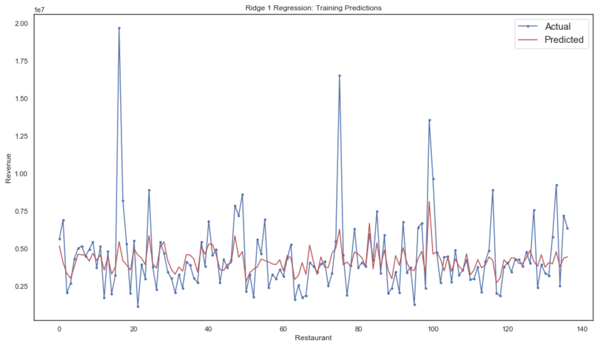

<h1 align='center'>Restaurant Revenue Prediction</h1>
 
<h3 align='center'>Daniel Baumann</h1>
 
____________________________________________________________________________________________________________________________
<h3 align='center'>The Problem</h3>

TFI is a company behind some of the world's most well-known brands, including Burger King, Popeyes etc. It is in their interest to find and develop new restaurant sites which will ultimately maximise their revenue and profitablity.
For this reason, they decided to open a competition on Kaggle, where entrants were tasked with predicting the revenue of restaurants given a multitude of factors
 
____________________________________________________________________________________________________________________________
<h3 align='center'>Project Objectives</h3>

The aim of this project is to create a model which can accurately predict the revenue of restaurant sites. This would allow TFI to invest with more confidence in given areas.   The dataset includes the following variables:

* The opening date of the restaurant
* The city it is located in
* The type of city (big or other)
* The type of restaurant (food court, drive thru etc)
* 37 categories of obfuscated data which include demographic, real estate and commercial factors
* The target variable: revenue
 
____________________________________________________________________________________________________________________________
<h3 align='center'>Methods Used</h3>

* Data visualisation
* Feature engineering
* Linear regression modelling (Ridge, XGBoost)
* Libraries used:
  * matplotlib, seaborn, sklearn, pandas, xgboost
 
____________________________________________________________________________________________________________________________
<h3 align='center'>Project Contents</h3>
 
The project contains the following:

* Exploratory data analysis and data preprocessing
  * Inspecting each variable and the effect on revenue
  * Creating dummy variables for categorical data
  * Creating new columns based on the relative price of cities
  * Data visualisation 
* Creating a baseline model
  * Using simple multi-variate linear regression to derive a baseline model
* Using grid search methods to find the optimal Ridge regression
  * Displaying a visualisation of training predictions compared with actual data
* Using grid search methods to find the optimal XGBoost regression model
  * Also displaying training versus xgboost predictions
* Showing scores of competition submission 
 
____________________________________________________________________________________________________________________________
<h3 align='center'>Project Description and Results</h3>

After extensive exploratory data analysis of each variable, with corresponding visualisations, I started creating a model based on the given training data. I also felt that regression modelling was the most appropriate method of solving this problem, partly due to the fact that there were only 137 restaurants in the training set. Using these 137 restaurants, the task was to predict the revenue of a test set that contained 100000 restaurants (many of which were created by Kaggle).

The best model was the Ridge regression model, which had a root mean squared error of 1755666 units of currency when compared with the real values in the testing set. XGBoost also performed relatively well coming in at a score of 1768459.
Interestingly, when plotting the comparisons of training versus testing set, I saw that there were a few outliers that my models all failed to predict. For this reason, I trained another XGBoost model which excluded these anomalies, but arrived at a higher error for the test set. Often, getting rid of anomalies may mean that the model which is being fit is overtrained to the training set, and thus cannot effectively predict any new data. 

 
____________________________________________________________________________________________________________________________
<h3 align='center'>Files Included</h3>

* Jupyter Notebook
 * 
